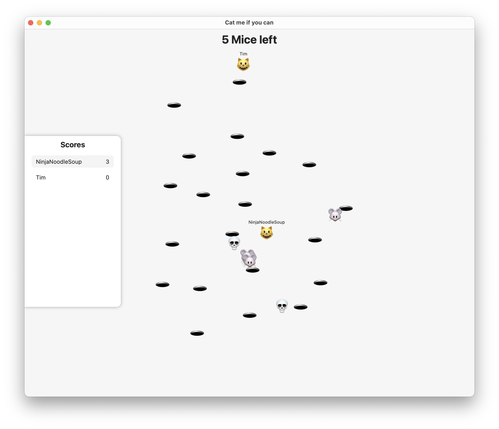

# Cat Me If U Can

Our solution for the lecture FOOP (Advanced Object Oriented Programming) 2023 at TU Wien.
We also wrote two single player versions one [in Eiffel](https://github.com/paulpinter/cat_me_if_u_can) 
and one [in Smalltalk](https://github.com/Jozott00/CatMe_SmallTalk).



This repository contains the source code for the "Cat Me If U Can" game, which includes a server/backend, client, and a shared library.

## Run the Server

```bash
cd Backend
swift run
```
The local server will listen on port `8080`.

**Note:** If you want to use the local in the client you need to change in
`Client/dev.xcconfig` the host field to `WS_HOST = localhost:8080`

## Repository Structure

The repository is organized into the following directories:

- `Backend/`: Contains the Vapor backend server for the game.
- `Client/`: Contains the SwiftUI-based frontend client for the game.
- `Shared/`: Contains the shared library with common code used by both the server and client.

## Shared Library

The Shared library provides common data structures, utilities, and game logic used by both the server and client components of the "Cat Me If U Can" game. The library helps maintain consistency between the server and client and allows for easy code sharing between the two components.

### Contents of Shared Library

Some of the main types and functionality provided by the Shared library include:

- `Protocol`: Includes types related to the communication protocol between the server and clients, such as messages, actions, updates, and errors.
- `Utilities`: Contains helper functions and extensions used throughout the game, such as vector operations, calculations, and other utility methods.

For more information read the README of the shared library.

## Development
We format the codebase with Apples [swift-format](https://github.com/apple/swift-format).

You can format the whole codebase with:
```bash
swift-format format -r -i .
```

Or use extensions for [VSCode](https://marketplace.visualstudio.com/items?itemName=vknabel.vscode-apple-swift-format)
and [XCode](https://github.com/ruiaureliano/X-SwiftFormat)